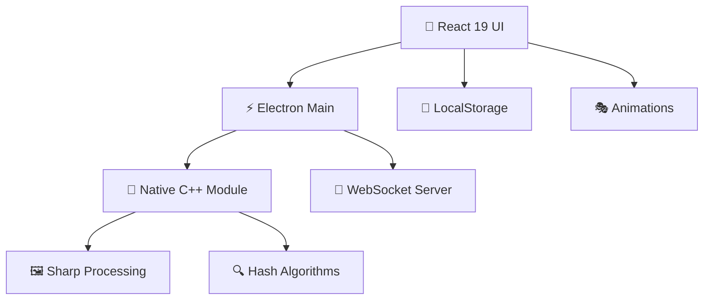

<div align="center">
  
# 📸 YG Unikalizer 3.2.0

### 🚀 **Революционная уникализация фото с React 19 и нативным ускорением**

*Трансформируйте, защищайте и оптимизируйте ваши изображения с максимальной скоростью и стилем*

---


### 🏆 **Технологический стек мирового класса**

[](https://www.electronjs.org/)
[](https://vitejs.dev/)
[](https://react.dev/)
[](https://www.typescriptlang.org/)

[](https://sharp.pixelplumbing.com/)
[](#нативное-ускорение)
[](#лицензия)

</div>

---

## ✨ **Что нового в v3.0.0 (архив)**

<table>
<tr>
<td width="50%">

### 🆕 **React 19 + Современные библиотеки**
- **🔥 Suspense** - плавная загрузка
- **🎯 Auto-animate** - магические анимации
- **🔔 Sonner Toast** - красивые уведомления
- **💾 LocalStorage** - умное сохранение настроек

</td>
<td width="50%">

### ⚡ **Повышенная производительность**
- **🚀 Debouncing** - оптимизированные настройки
- **🛡️ Electron IPC** - безопасные вызовы
- **🎨 CSS Utilities** - clsx + tailwind-merge
- **📱 React Hooks** - useLocalStorage, useDebounce

</td>
</tr>
</table>

> **⚠️ Breaking Changes:** Обновление с react-hot-toast на sonner, новые TypeScript типы, CSS переменные

---

## 🎯 **Ключевые возможности**

<div align="center">

### 🖼️ **Форматы и обработка**
| Формат | Чтение | Запись | Метаданные | Особенности |
|--------|--------|--------|------------|-------------|
| **JPG** | ✅ | ✅ | ✅ EXIF/IPTC/XMP | Прогрессивная развёртка |
| **PNG** | ✅ | ✅ | ✅ XMP/текст | Альфа-канал |
| **WebP** | ✅ | ✅ | ✅ XMP | Лучшее сжатие |
| **AVIF** | ✅ | ✅ | ✅ XMP | Новейший стандарт |
| **HEIC/HEIF** | ✅ | ✅ | ✅ EXIF | Apple формат |

</div>

### 🛡️ **Уникализация и защита**

```yaml
🎨 Цветовой дрейф: Тонкие изменения RGB для обхода детектирования
📐 Изменение размера: Умное масштабирование с сохранением пропорций  
🔍 Ограничение ширины: Контроль максимального разрешения
🗂️ Гибкое именование: {name}_{index}_{date}_{uuid}_{rand}
```

### 🏷️ **Метаданные и приватность**

<table>
<tr>
<td width="33%">

#### 🧹 **Очистка**
- ✅ Полная очистка EXIF
- ✅ Удаление GPS координат
- ✅ Очистка IPTC/XMP
- ✅ Удаление профилей ICC

</td>
<td width="33%">

#### 🎭 **Fake EXIF**
- 📷 Профили камер/телефонов
- 🎯 Реалистичные параметры
- 🌍 Fake GPS координаты
- ⭐ Рейтинги и метки

</td>
<td width="33%">

#### 📝 **Кастомные данные**
- ✍️ Автор и copyright
- 📋 Описание и ключевые слова
- 🏷️ Заголовки и метки
- 🔧 Информация о ПО

</td>
</tr>
</table>

---

## 🚀 **Суперскорость и производительность**

<div align="center">

### ⚡ **Нативное ускорение C++**

```cpp
// 🔥 Встроенные алгоритмы для максимальной скорости
✨ WIC декодирование (Windows)     → 5x быстрее
🔍 Перцепционные хеши a/d/pHash   → Нативный C++
🌊 xxHash64 для содержимого       → SIMD оптимизация
🎯 Индекс Хэмминга                → Быстрый поиск дубликатов
```

### 🎭 **Продвинутый поиск дубликатов**

| Алгоритм | Назначение | Точность | Скорость |
|----------|------------|----------|----------|
| **aHash** | Средняя схожесть | 🎯🎯🎯 | ⚡⚡⚡ |
| **dHash** | Различия градиентов | 🎯🎯🎯🎯 | ⚡⚡⚡ |
| **pHash** | Высокая точность | 🎯🎯🎯🎯🎯 | ⚡⚡ |

</div>

---

## 🎨 **Современный пользовательский интерфейс**


### 🎪 **React 19 + Анимации**

```typescript
✨ Suspense boundaries для плавной загрузки
🎭 Auto-animate для магических переходов  
🔔 Sonner toast с богатыми уведомлениями
💾 useLocalStorage для умного сохранения
⚡ useDebounce для оптимизированного ввода
🎨 clsx + tailwind-merge для CSS магии
```

### 🎮 **Fun Zone**

- 🎲 **Crash Game** - азартная мини-игра с экспоненциальной кривой
- 🎰 **Slots** - 5×3 слот-машина с 10 линиями выплат
- 🎊 **Анимации** - плавные переходы и эффекты

---

## 💻 **Быстрый старт**

### 📦 **Установка для разработки**

```bash
# 1️⃣ Клонируйте репозиторий
git clone https://github.com/YALOKGAR/PhotoUnikalizer.git
cd PhotoUnikalizer

# 2️⃣ Установите зависимости
npm install

# 3️⃣ Запустите в режиме разработки
npm run dev

# 🚀 Приложение откроется автоматически!
```

### 🏗️ **Сборка production**

```bash
# 📦 Сборка приложения
npm run build

# 🎁 Создание инсталлятора
npm run dist

# 📋 Результат в папке dist/
```

### 🔧 **Полезные команды**

<table>
<tr>
<td width="50%">

#### 🛠️ **Разработка**
```bash
npm run dev          # Режим разработки
npm run build        # Сборка приложения  
npm run lint         # Проверка кода
npm run type-check   # Проверка типов
```

</td>
<td width="50%">

#### 🏭 **Производство**
```bash
npm run dist           # Инсталлятор
npm run native:build   # C++ модуль
npm run assets:icons   # Генерация иконок
npm run chat:server    # WS сервер
```

</td>
</tr>
</table>

---

## 🏛️ **Архитектура**

<div align="center">

### 🧩 **Компоненты системы**



</div>

| Слой | Технологии | Назначение |
|------|------------|------------|
| **🎨 Frontend** | React 19, TypeScript, Tailwind | Современный UI с анимациями |
| **⚡ Backend** | Electron, Node.js | Десктопное приложение |
| **🔧 Native** | C++, N-API, Sharp | Высокопроизводительная обработка |
| **📡 Network** | WebSocket, HTTP | Чат и обновления |
| **💾 Storage** | LocalStorage, File System | Настройки и кеш |

---

## 🌍 **Многоязычность**

<div align="center">

| Язык | Статус | Покрытие |
|------|--------|----------|
| 🇷🇺 **Русский** | ✅ Полное | 100% |
| 🇺🇦 **Українська** | ✅ Полное | 100% |
| 🇺🇸 **English** | ✅ Полное | 100% |
| 🇸🇦 **العربية** | ✅ Базовое | 80% |
| 🇨🇳 **中文** | ✅ Базовое | 80% |

*Переключение языка в настройках с автосохранением*

</div>

---

## 📊 **Системные требования**

<table>
<tr>
<td width="50%">

### ✅ **Минимальные требования**
- 🖥️ **ОС:** Windows 10 x64 (1903+)
- 💾 **RAM:** 4 GB
- 💿 **Диск:** 500 MB свободного места
- 🖼️ **GPU:** Поддержка DirectX 11

</td>
<td width="50%">

### 🚀 **Рекомендуемые**
- 🖥️ **ОС:** Windows 11 x64
- 💾 **RAM:** 8+ GB  
- 💿 **SSD:** 2+ GB свободного места
- 🖼️ **GPU:** Дискретная видеокарта

</td>
</tr>
</table>

---

### 🎯 **Как помочь проекту**

```bash
# 1️⃣ Форкните репозиторий
# 2️⃣ Создайте feature ветку
git checkout -b feature/amazing-feature

# 3️⃣ Внесите изменения и коммитьте
git commit -m "✨ Add amazing feature"

# 4️⃣ Запушьте ветку
git push origin feature/amazing-feature

# 5️⃣ Откройте Pull Request
```

## 🏆 **Благодарности**

<div align="center">

### 💝 **Особая благодарность**

| Проект | Вклад | Ссылка |
|--------|-------|--------|
| **React** | 🚀 Современный UI фреймворк | [react.dev](https://react.dev) |
| **Electron** | 🖥️ Кроссплатформенные приложения | [electronjs.org](https://electronjs.org) |
| **Sharp** | 🖼️ Быстрая обработка изображений | [sharp.pixelplumbing.com](https://sharp.pixelplumbing.com) |
| **Tailwind CSS** | 🎨 Утилитарный CSS фреймворк | [tailwindcss.com](https://tailwindcss.com) |

### 🌟 **Звезды проекта**

Если проект помог вам, поставьте ⭐ на GitHub!

[](https://github.com/YALOKGAR/PhotoUnikalizer/stargazers)

</div>

---

## 📄 **Лицензия**

<div align="center">

**PhotoUnikalizer** распространяется под лицензией **MIT**

```
MIT License © 2025 YALOKGAR

Разрешается свободное использование, изменение и распространение
при условии сохранения уведомления об авторских правах.
```

[](LICENSE)

---

### 🎉 **Спасибо за использование PhotoUnikalizer!**

*Сделано с ❤️ и ☕ для сообщества разработчиков*

**⭐ Не забудьте поставить звездочку, если проект понравился!**

</div>